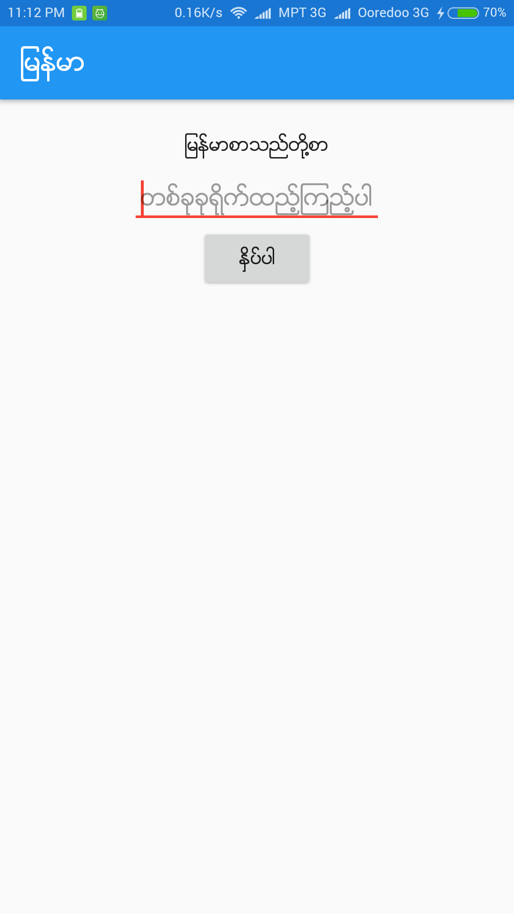
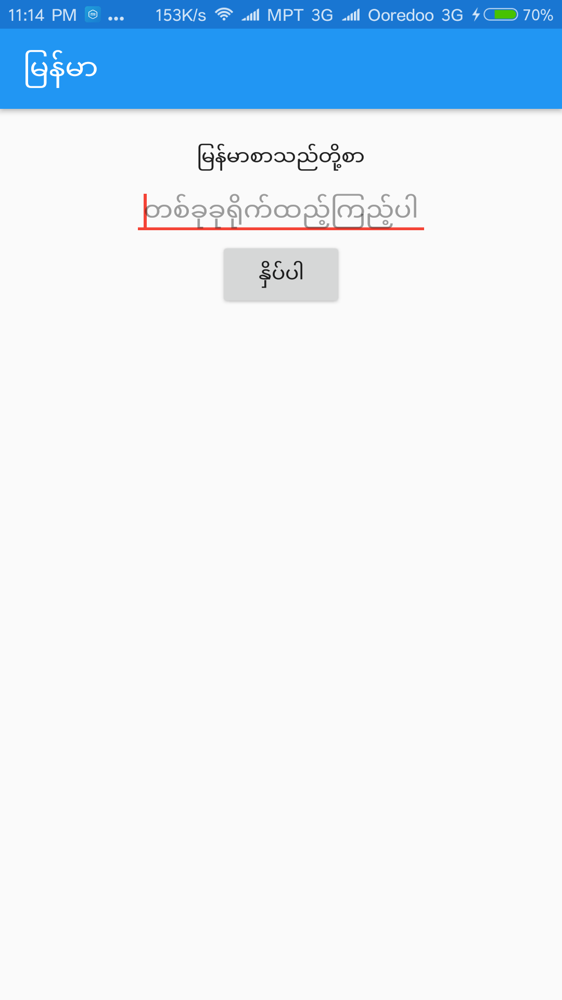

# MDetect

MDetect is yet another library for displaying Burmese texts for Android.

        

Zawgyi device and Unicode device

## How it works

MDetect detects the device's font i.e. whether the user is using Unicode or Zawgyi by drawing က္က and compare the width with က. It doesnt embed any font and convert the text to Zawgyi if the user is using Zawgyi and it doesn't effect the performance of the app much.

## Download
Gradle:
```groovy
compile 'myatminsoe.mdetect.android:mdetect-android:3.0'
```
or Maven:
```xml
<dependency>
  <groupId>myatminsoe.mdetect.android</groupId>
  <artifactId>mdetect-android</artifactId>
  <version>3.0</version>
  <type>pom</type>
</dependency>
```
## How to use

### Kotlin
Initialize MDetect on your Application class onCreate.
```kotlin
override fun onCreate() {
    super.onCreate()
    MDetect.init(this)
}
```
MDetect can be used for deciding whether the user is using Unicode.
```kotlin
if (MDetect.isUnicode()){
  //user is using Unicode
} else {
  //user is using Zawgyi or showing squares
}
```

### Java
Initialize MDetect on your Application class onCreate.
```java
@Override
public void onCreate() {
    super.onCreate();
    MDetect.INSTANCE.init(this);
}
```

MDetect can be used for deciding whether the user is using Unicode.
```java
if (MDetect.INSTANCE.isUnicode()){
  //user is using Unicode
} else {
  //user is using Zawgyi or showing squares
}
```

MDetect have custom views for **TextView**, **EditText** and **Button**
```xml
<LinearLayout xmlns:android="http://schemas.android.com/apk/res/android"
    android:layout_width="match_parent"
    android:layout_height="match_parent"
    android:gravity="center_horizontal"
    android:orientation="vertical"
    android:padding="16dp"
    >

  <me.myatminsoe.mdetect.MMTextView
      android:layout_width="wrap_content"
      android:layout_height="wrap_content"
      android:padding="8dp"
      android:text="@string/myanmar_textview"
      android:textColor="@color/grey_900"
      />

  <me.myatminsoe.mdetect.MMEditText
      android:layout_width="wrap_content"
      android:layout_height="wrap_content"
      android:hint="@string/myanmar_edittext"
      android:padding="8dp"
      />

  <me.myatminsoe.mdetect.MMButtonView
      android:layout_width="wrap_content"
      android:layout_height="wrap_content"
      android:onClick="showMyanmarToast"
      android:padding="8dp"
      android:text="@string/myanmar_button"
      />

</LinearLayout>
```

### Setting and Getting Text
use setMMText() and getMMText() instead of setText() and getText() for custom views.

## Toast
### Kotlin
```kotlin
MMToast.makeText(context, "မင်္ဂလာပါ", MMToast.LENGTH_LONG).show();
```

### Java
```java
MMToast.INSTANCE.makeText(context, "မင်္ဂလာပါ", MMToast.INSTANCE.LENGTH_LONG).show();
```

## Zawgyi <-> Unicode Converter
MDetect use [Rabbit Converter](https://github.com/Rabbit-Converter/Rabbit) for converting Zawgyi and Unicode and you can also use the features from Rabbit Converter.
### Kotlin
```kotlin
val uniSt = Rabbit.zg2uni("ေနေကာင္းလား"); //နေကောင်းလား
val zgSt = Rabbit.uni2zg("နေကောင်းလား"); //ေနေကာင္းလား
```

### Java
```java
String uniSt = Rabbit.zg2uni("ေနေကာင္းလား"); //နေကောင်းလား
String zgSt = Rabbit.uni2zg("နေကောင်းလား"); //ေနေကာင္းလား
```


See the sample app for more detail.

# License
```
MIT License

Copyright (c) 2016 Myat Min Soe

Permission is hereby granted, free of charge, to any person obtaining a copy
of this software and associated documentation files (the "Software"), to deal
in the Software without restriction, including without limitation the rights
to use, copy, modify, merge, publish, distribute, sublicense, and/or sell
copies of the Software, and to permit persons to whom the Software is
furnished to do so, subject to the following conditions:

The above copyright notice and this permission notice shall be included in all
copies or substantial portions of the Software.

THE SOFTWARE IS PROVIDED "AS IS", WITHOUT WARRANTY OF ANY KIND, EXPRESS OR
IMPLIED, INCLUDING BUT NOT LIMITED TO THE WARRANTIES OF MERCHANTABILITY,
FITNESS FOR A PARTICULAR PURPOSE AND NONINFRINGEMENT. IN NO EVENT SHALL THE
AUTHORS OR COPYRIGHT HOLDERS BE LIABLE FOR ANY CLAIM, DAMAGES OR OTHER
LIABILITY, WHETHER IN AN ACTION OF CONTRACT, TORT OR OTHERWISE, ARISING FROM,
OUT OF OR IN CONNECTION WITH THE SOFTWARE OR THE USE OR OTHER DEALINGS IN THE
SOFTWARE.
```